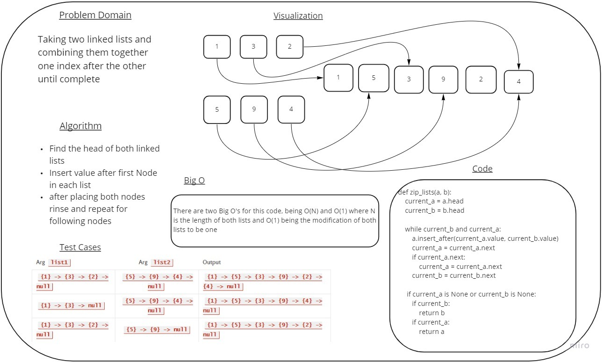

# Code Challenge 8

## Challenge Summary

Zip two linked lists.

## Whiteboard

## Approach & Efficiency

## Solution

def zip_lists(a, b):
    current_a = a.head
    current_b = b.head

    while current_b and current_a:
        a.insert_after(current_a.value, current_b.value)
        current_a = current_a.next
        if current_a.next:
            current_a = current_a.next
        current_b = current_b.next

    if current_a is None or current_b is None:
        if current_b:
            return b
        if current_a:
            return a

    return a

## Collaborators
Ryan McMillan, Ricky Plaza, Jamal Malik